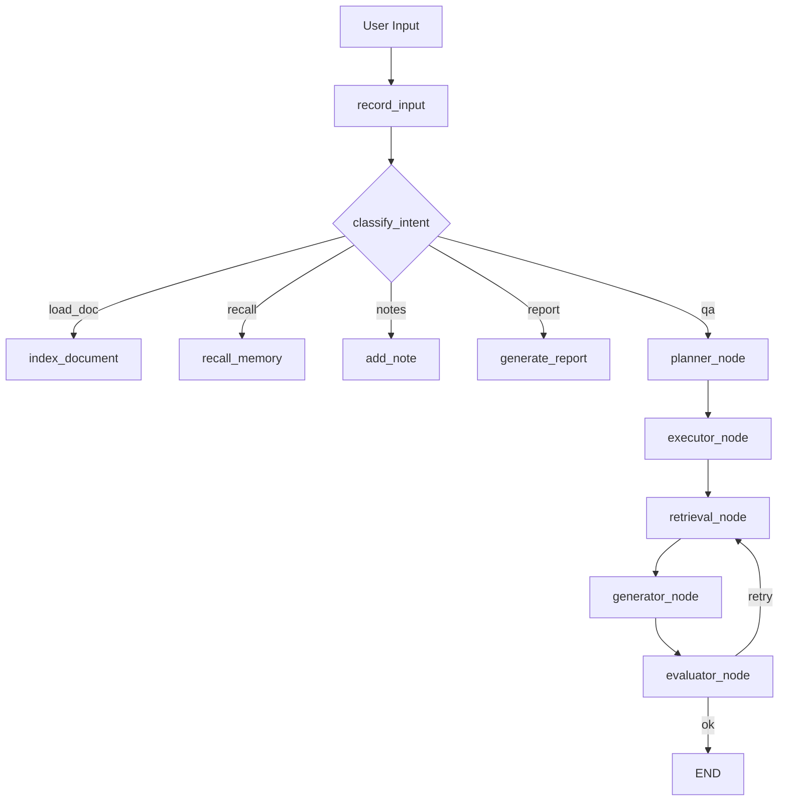

---
tags:
  - project
  - agent
  - langgraph
  - rag
  - internship
created: 2025-06-01
updated: 2026-06-07
status: active
role: author
skills:
  - langgraph
  - langchain
  - multi-agent
  - rag
  - llm
  - python
  - gradio
repo: hello-agents/code/chapter8-langgraph
---

# 智能文档问答助手

> [!info] 一句话概述
> 基于 [[LangGraph]] 构建的**多智能体文档问答系统**，实现 Planning / Tool Use / Multi-Agent / Evaluation 四大 Agent 核心能力，支持 PDF 知识库的智能检索与流式问答。

---

## 技术栈

| 层级 | 技术 |
|------|------|
| **Agent 框架** | LangGraph 1.2 + LangChain 1.3 |
| **LLM** | DeepSeek-V3 / 智谱 GLM-4 / 通义千问 / GPT-4o |
| **Embedding** | 智谱 embedding-2 / DashScope text-embedding-v3 |
| **向量数据库** | Qdrant Cloud（Cosine 距离） |
| **检索增强** | MQE 多查询扩展 + HyDE 假设文档嵌入 |
| **工具调用** | Function Calling + ToolCenter 工具中心 |
| **评估体系** | RAGAS 四维 LLM-as-Judge |
| **前端** | Gradio 6.x，stream_mode="custom" 流式输出 |
| **持久化** | SQLite Checkpoint + JSON Log |
| **配置管理** | YAML 驱动，200+ 参数集中管理 |
| **语言** | Python 3.12 |

---

## 系统架构

> [!note] 核心架构：Supervisor Pattern
> 1 个 Supervisor 调度 5 个专职 Agent，通过条件路由实现**规划 → 执行 → 检索 → 生成 → 评估 → 自动重试**完整闭环。



### 五个 Agent

| Agent | 职责 |
|-------|------|
| **Planner** | LLM 拆解用户问题 → 2~5 步执行计划（JSON 结构化输出） |
| **Executor** | 解析计划中的 `tool_call` 步骤，调用 ToolCenter 执行工具 |
| **Retrieval** | MQE 生成 3 个变体查询 + HyDE 生成假设答案 → 多路检索 → 去重合并 |
| **Generator** | 基于检索上下文流式生成 RAG 答案 + 引用标注 |
| **Evaluator** | reflect() 评分 + RAGAS 四维评估 → 不达标自动重试（最多 2 次） |

---

## 项目亮点

### 1. 多智能体协作架构

- **11 个图节点 + 2 个条件路由**，实现完整的 Agent 工作流
- **重试闭环**：评估不通过 → 自动跳回检索节点重新检索和生成
- **状态持久化**：SQLite Checkpoint 保存对话状态，`thread_id` 隔离多用户
- **流式可视化**：每个 Agent 的协作日志实时推送到前端 Chatbot

### 2. RAGAS 深度评估

> [!important] 自研 LLM-as-Judge 评估管线
> 每次问答自动运行四维评估，每个指标有独立的 Judge Prompt + JSON Schema 约束输出。

| 指标 | 评估内容 | 阈值 |
|------|----------|------|
| Faithfulness | 答案声明能否在上下文中验证 | ≥ 0.7 |
| Answer Relevancy | 答案是否切题 | ≥ 0.7 |
| Context Precision | 检索结果信噪比 | ≥ 0.6 |
| Context Recall | 上下文是否覆盖所有必要信息 | ≥ 0.6 |

### 3. 高级 RAG 管线

- **MQE**：LLM 生成 3 个语义等价变体查询，多路召回合并
- **HyDE**：LLM 生成假设性答案，用答案向量检索原文
- **文档去重**：SHA-256 哈希 + Qdrant payload 索引
- **批处理**：Embedding 批量调用（batch=10），适配 API 限流

### 4. 工程化能力

- **配置驱动**：`agent_config.yaml` 200+ 行集中管理所有参数
- **工具中心**：ToolCenter 单例，支持工具注册/启禁用/调用统计/延迟监控
- **执行追踪**：节点级耗时和 Token 消耗追踪 → `trace_log.json`
- **多模型热切换**：7 个 LLM 供应商统一工厂，UI 下拉框实时切换
- **成本监控**：每次 LLM 调用自动估算成本，累计超 ¥10 预警

---

## 关键设计决策

> [!question] 为什么用 Supervisor 模式而不是单一 Agent？
> **职责分离**：各 Agent 聚焦单一职责，便于独立调试和优化。评估不通过可以直接重新检索和生成，不需要重新规划。

> [!question] MQE 和 HyDE 的原理？
> - **MQE**：同一问题换多种表述分别检索 → 弥补"用户提问"和"文档表述"的语义 Gap
> - **HyDE**：先让 LLM 写一个答案，用答案去检索 → 答案的语料风格比问题更接近文档原文

> [!question] RAGAS 四个指标分别怎么算的？
> 全部基于 LLM-as-Judge。Faithfulness 拆解声明逐条验证；Relevancy 判断是否切题和遗漏；Precision 评估检索信噪比；Recall 判断上下文覆盖度。四个指标各有独立 Prompt 模板。

> [!question] 如何控制 Token 消耗？
> 1. RAGAS 按需触发，不是每次都跑
> 2. 上下文截断 3000 字符
> 3. MQE 扩展数量可配置
> 4. 执行追踪系统监控每次 Token 消耗

> [!question] 如何处理 LLM 返回格式不正确？
> Planner 和 Reflector 有 JSON 解析失败的兜底策略。Planner 降级为单步 `answer`，Reflector 默认 `score=3, quality="good"`。

---

## 文件结构

```
chapter8-langgraph/               # 主项目目录
├── main.py                        # 启动入口
├── graph.py                       # 图构建委托
├── state.py                       # DocQAState 状态定义（20+ 字段）
├── agent_config.yaml              # 全局配置（模型/工具/Agent/评估）
├── config_loader.py               # 配置加载单例
├── model_factory.py               # 多模型统一工厂
├── tools.py                       # 工具定义（4 个 @tool）
├── tool_center.py                 # 工具中心（注册/统计/启禁用）
├── planner.py                     # 任务规划（LLM → JSON 计划）
├── reflector.py                   # 质量反思（LLM 评分 1-5）
├── evaluator.py                   # 评估体系（成本/命中率/幻觉检测）
├── ragas_eval.py                  # RAGAS 四维评估
├── rag_pipeline.py                # PDF 加载 + 分块 + 向量化 + 检索
├── tracer.py                      # 执行追踪（节点级 Token/耗时）
├── theme.py                       # UI 主题
├── ui.py                          # Gradio Web 界面（8 个 Tab）
├── DEVELOPMENT.md                 # 完整开发文档
├── RESUME.md                      # 简历项目描述
├── agents/
│   ├── supervisor.py              # **核心**：图拓扑 + 11 节点 + 条件路由
│   ├── schemas.py                 # 子 Agent 状态定义
│   ├── planner_agent.py           # 独立规划器子图
│   ├── retrieval_agent.py         # 独立检索器子图
│   ├── generator_agent.py         # 独立生成器子图
│   └── evaluator_agent.py         # 独立评估器子图
├── checkpoints.db                 # SQLite 状态持久化
├── eval_log.json                  # 评估记录
├── trace_log.json                 # 执行追踪日志
└── learning_notes.json            # 学习笔记
```

---

## 关键代码片段

### StateGraph 核心拓扑（supervisor.py）

```python
builder = StateGraph(DocQAState)

# 11 个节点
builder.add_node("record_input", record_input)
builder.add_node("classify_intent", classify_intent)
builder.add_node("index_document", index_document)
# ... planner_node, executor_node, retrieval_node, generator_node, evaluator_node

# 连线
builder.add_edge(START, "record_input")
builder.add_edge("record_input", "classify_intent")

# 条件路由：意图分发
builder.add_conditional_edges("classify_intent", route_by_intent, {
    "index_document": "index_document",
    "planner_node": "planner_node",
    "recall_memory": "recall_memory",
    "add_note": "add_note",
    "generate_report": "generate_report",
})

# Agent 循环
builder.add_edge("planner_node", "executor_node")
builder.add_edge("executor_node", "retrieval_node")
builder.add_edge("retrieval_node", "generator_node")
builder.add_edge("generator_node", "evaluator_node")

# 条件路由：评估后重试或结束
builder.add_conditional_edges("evaluator_node", route_after_eval, {
    "retrieval_node": "retrieval_node",  # 重试
    "__end__": END,
})

return builder.compile(checkpointer=SqliteSaver(sqlite3_conn))
```

### RAGAS 评估入口（ragas_eval.py）

```python
def run_ragas_evaluation(question, answer, context, retrieval_results):
    results = {}
    if "faithfulness" in metrics:
        results["faithfulness"] = evaluate_faithfulness(answer, context)
    if "answer_relevancy" in metrics:
        results["answer_relevancy"] = evaluate_answer_relevancy(question, answer)
    if "context_precision" in metrics:
        results["context_precision"] = evaluate_context_precision(question, retrieval_results)
    if "context_recall" in metrics:
        results["context_recall"] = evaluate_context_recall(question, answer, context)

    overall = mean(scores)
    verdict = "pass" if overall >= 0.7 else ("warning" if overall >= 0.5 else "fail")
    return {**results, "overall_score": overall, "verdict": verdict}
```

---

## 面试准备

### 技术深度

> [!faq]- LangGraph 的 StateGraph 和 LangChain Chain 有什么区别？
> StateGraph 是基于图的状态机，每个节点读写共享 State，支持条件路由和图内循环。Chain 是线性 DAG，不支持循环。我这个项目用 StateGraph 的循环能力实现了"评估不通过 → 重新检索 → 重新生成 → 重新评估"的重试闭环。

> [!faq]- MQE 和 HyDE 的原理？为什么能提升检索效果？
> MQE 通过 LLM 生成同一问题的多种表述，弥补用户提问和文档原文的语义 Gap。HyDE 先让 LLM 生成假设性答案，用答案的向量去检索——答案的语料风格更接近文档原文，匹配度更高。

> [!faq]- RAGAS 评估四个指标分别怎么算？和普通 RAG 评估有什么区别？
> 全部基于 LLM-as-Judge，不用传统 n-gram 匹配。Faithfulness 拆解声明逐条在上下文中验证；Relevancy 判断答案是否切题；Precision 评估检索排名质量；Recall 评估覆盖度。比 BLEU/ROUGE 更能反映语义质量。

> [!faq]- 工具调用是怎么实现的？如何处理调用失败？
> 基于 LangChain `@tool` 装饰器定义工具（calculator/web_search/read_notes/get_current_time），ToolCenter 单例管理注册和调用统计。计算器用正则提取表达式 + 沙盒 eval，搜索用 Tavily API。每个工具调用都 try-catch 包裹，错误以字符串返回给 LLM 让它自行调整。

> [!faq]- 为什么要用 SQLite Checkpoint 而不是直接用内存？
> 1. 页面刷新后对话状态不丢失 2. Graph 被中断后可以从检查点恢复 3. 多用户隔离（不同 thread_id） 4. 支持 time travel 调试（未来可扩展）。`check_same_thread=False` 是为了兼容 Gradio 的多线程事件处理。

### 系统设计

> [!faq]- 为什么用 Supervisor 而不是把所有逻辑写在一个节点？
> 职责分离，各 Agent 可独立调试优化。评估不通过可只重新检索和生成，无需重新规划。也便于后续替换某个 Agent 的实现。

> [!faq]- 如何保证系统的高可用？
> 配置驱动改 YAML 不改代码、模型热切换 API 挂了切备用、工具中心运行时启禁用、文档索引 SHA-256 去重避免重复向量化。

> [!faq]- 如果部署到生产环境还需要做哪些改进？
> 1. 认证鉴权（`gr.Chatbot` → `auth=("user","pass")` 或 OAuth）
> 2. 异步执行（`graph.ainvoke()` / `graph.astream()`）
> 3. 并发限制（请求队列 + 速率限制）
> 4. 日志集中化（接入 LangSmith 或自建 ELK）
> 5. 监控告警（Prometheus + Grafana）
> 6. 容器化部署（Docker + docker-compose）

---

## 简历话术模板

可根据投递岗位选择侧重点：

**侧重 Agent/AI**（投 AI 工程师岗）：
> 基于 LangGraph StateGraph 构建 5-Agent 协作架构（Planner/Executor/Retrieval/Generator/Evaluator），实现 Planning → Tool Use → Retrieval → Generation → Evaluation 完整闭环。自研 RAGAS 四维 LLM-as-Judge 评估管线，MQE + HyDE 高级检索策略，支持 7 个 LLM 供应商热切换。

**侧重工程/后端**（投后端/全栈岗）：
> 设计 Supervisor 模式的 StateGraph 图拓扑，11 个节点 + 2 个条件路由。搭建配置驱动的工程架构（200+ YAML 参数），ToolCenter 单例工具中心（注册/启禁用/统计/监控），SQLite Checkpoint 状态持久化，节点级 Token 和耗时追踪系统。

**精简版**（投递时需要压缩篇幅）：
> 基于 LangGraph 构建多智能体文档问答系统，实现 5-Agent 协作架构、RAGAS 质量评估体系和 MQE+HyDE 检索管线。支持 7 个 LLM 供应商热切换，YAML 配置驱动。

---

## 相关笔记

- [[LangGraph 学习笔记]]
- [[RAG 技术总结]]
- [[Multi-Agent 架构模式]]
- [[LLM-as-Judge 评估方法]]
- [[Python Agent 面试准备]]
- [[Gradio 前端开发]]

---

> [!tip] 维护说明
> - 技术栈更新时同步修改 frontmatter 的 `updated` 日期
> - 新增功能时在"项目亮点"区域追加
> - 面试遇到新问题可添加到"面试准备"折叠区
